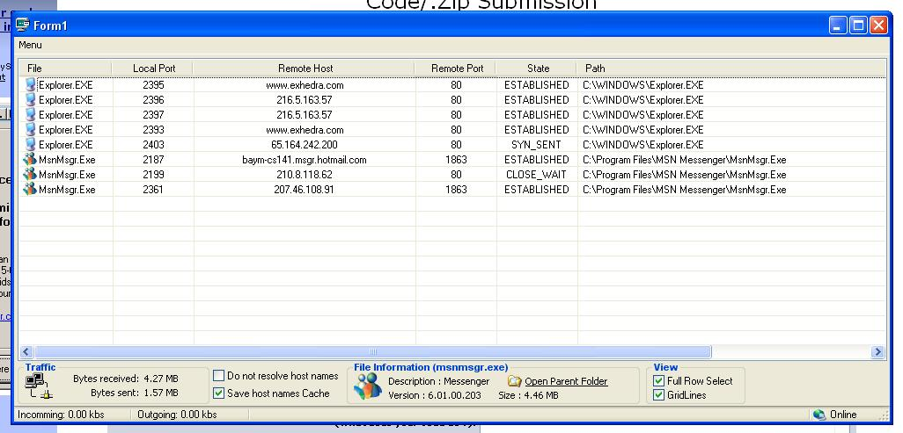



## XP Connections Monitor \*Final\*

### Description

using the xp allocateandgetstack command this program will return all connections comming to and from your computer displyaing them in a listview with their appropriate file icons as well as showing information on the currently selected file, also alows you to terminate connection and/or program. Utilised with a traffic view showing all bytes sent and recieved during you online session as well as bytes/s (look at screen shot) i have also included a manifest file incorporated into the resource file so the program will create its own if one is not found. Many thanks go out to people sharing there code as some has been used in this project i have left most of the comments so gratitude can be shown.
 
### More Info
 

             |
---                |---
**Submitted On**   |2004-01-01 15:52:06
**By**             |[JayStacey](https://github.com/Planet-Source-Code/PSCIndex/blob/master/ByAuthor/jaystacey.md)
**Level**          |Intermediate
**User Rating**    |5.0 (65 globes from 13 users)
**Compatibility**  |VB 5\.0, VB 6\.0
**Category**       |[Internet/ HTML](https://github.com/Planet-Source-Code/PSCIndex/blob/master/ByCategory/internet-html__1-34.md)
**World**          |[Visual Basic](https://github.com/Planet-Source-Code/PSCIndex/blob/master/ByWorld/visual-basic.md)
**Archive File**   |[XP\_Connect168927112004\.zip](https://github.com/Planet-Source-Code/jaystacey-xp-connections-monitor-final__1-50721/archive/master.zip)

